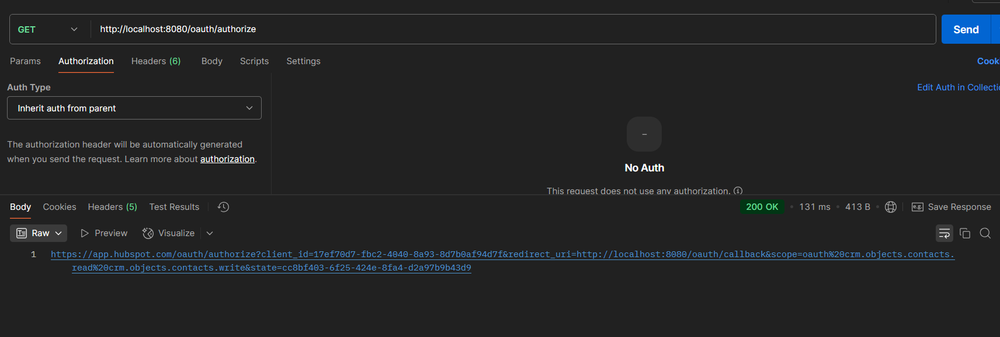
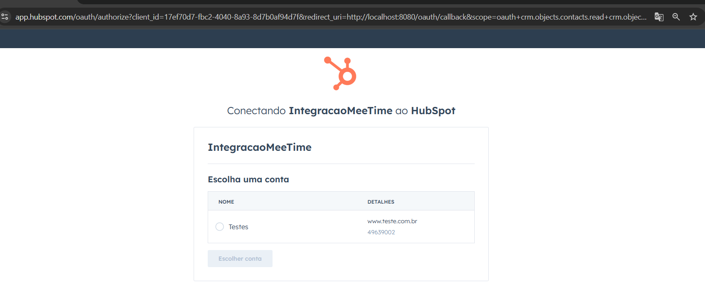
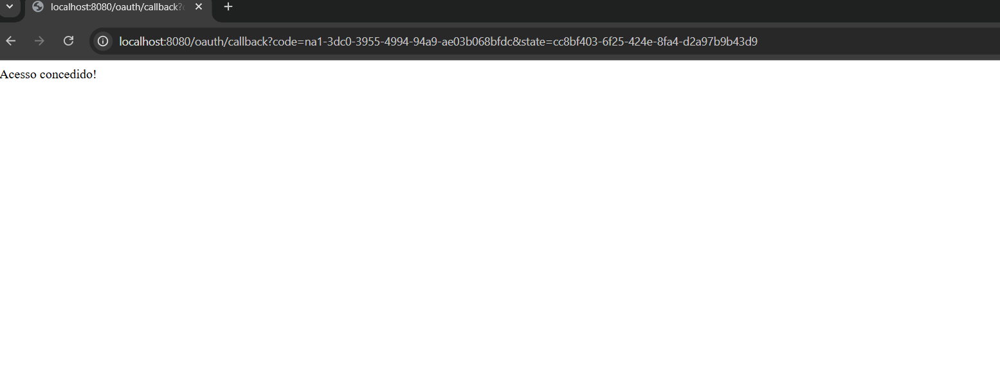
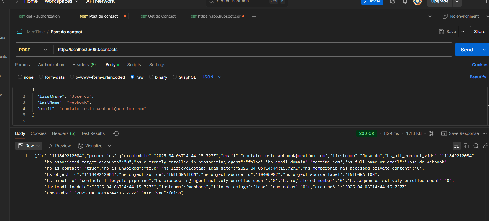
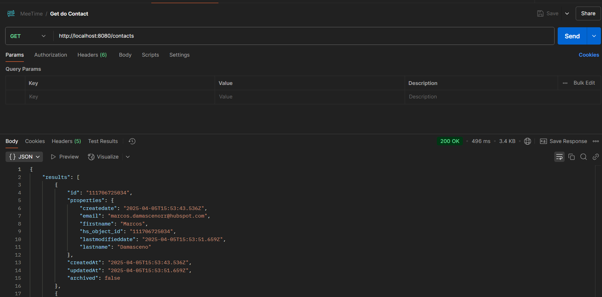
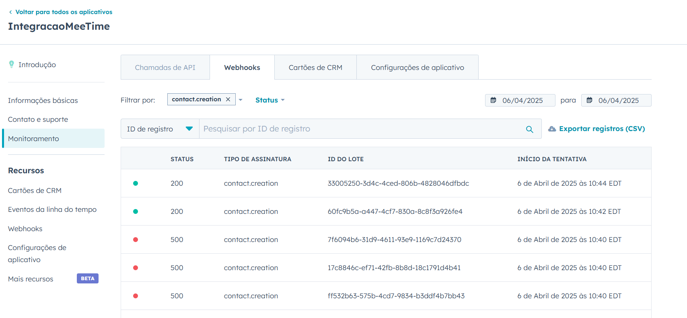

# Guia de Testes da API 🚀

Este documento serve como um passo a passo para testar os principais endpoints desta API.

---

## 1. Autenticação com OAuth2

1. Faça uma requisição para o endpoint `/oauth/authorize` pelo Postman:
   **GET** `http://localhost:8080/oauth/authorize`

2. Um link será gerado. Clique nele para autorizar o acesso:
   
   


3. Após fazer login no HubSpot, você será redirecionado para o callback configurado (exemplo: `http://localhost:8080/oauth/callback?code=<code>`).
4. Você receberá uma mensagem de acesso concedido ou negado em caso de "acesso concedido".

4. O token já estará armazenado na aplicação

---

## 2. Criar Contato
- Volte para o postman
- Endpoint: **POST** `http://localhost:8080/contacts`
- Body do Request:
  ```json
  {
      "firstName": "João",
      "lastName": "Silva",
      "email": "joao.silva@email.com"
  }
  ```



---

## 3. Listar Contatos
- Endpoint: **GET** `http://localhost:8080/contacts`
  
---

## 4. Webhook
O webhook foi configurado para `http://localhost:8080/contacts/webhook`, na aplicação feita porém para isso é necessario simular localmente, use ferramentas como `ngrok` ou similares.


---
Testes concluídos com sucesso!